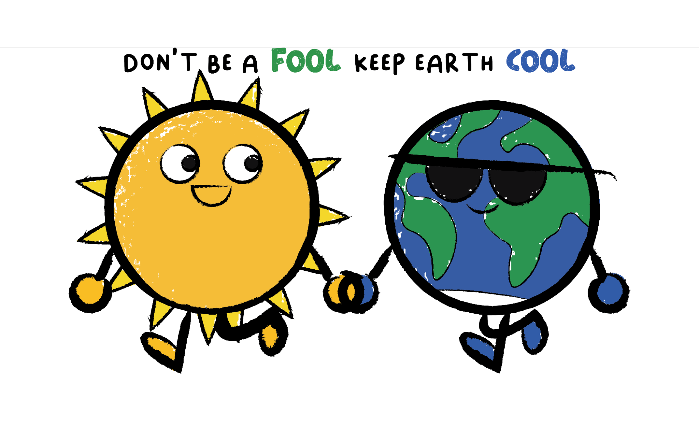
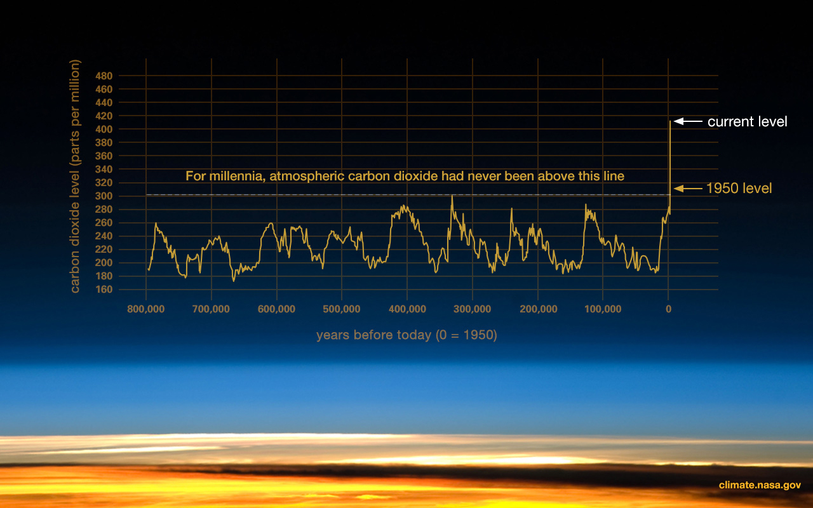
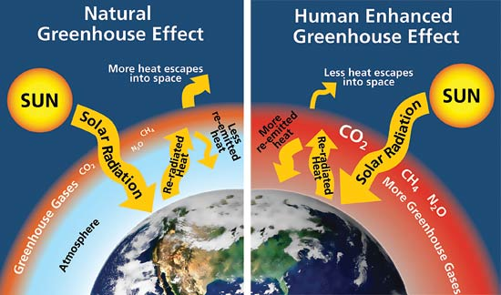
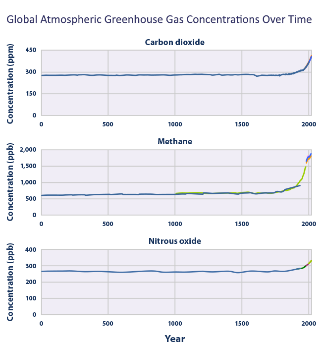
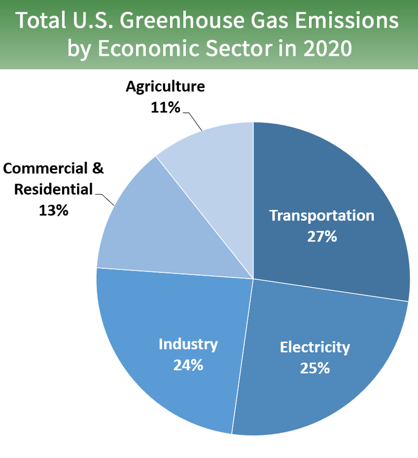
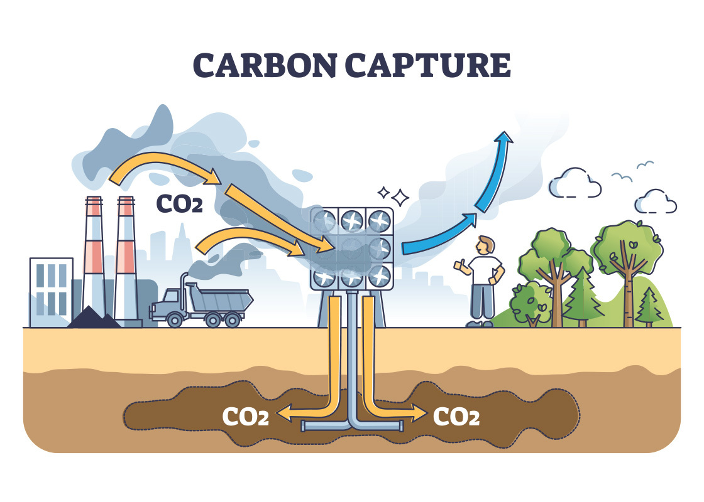
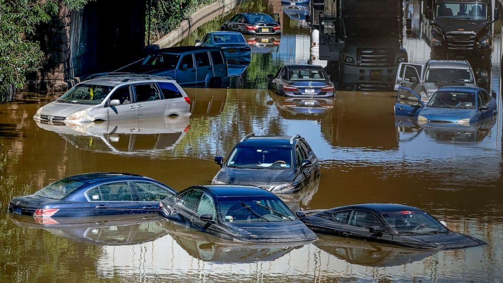

# Welcome to keepearthcool.info!

The purpose of this website is to inform and educate as many people as
possible of the threat of long lasting climate change. This website will
also cover the largest areas of carbon emission, as well as what you can
do as an individual to contribute to tackling this difficult problem.
Thank you for visiting, and enjoy your stay!

 ### What is Climate Change?

Climate Change broadly refers to major shifts in
temperature and weather, which may be natural, or human originated.
However, since the 19th century, human driven industrialization and
energy demands have been the largest contributor to climate change.
Evidence of Climate Change can be seen in changing temperature and rain
patterns, increase in ocean temperature, acidity, and rise in sea level,
melting of permafrost and ice sheets, as well as great shifts in
ecosystems around the world.

 ### How does our climate work?

One major reason for what makes Earth so unique is its ability to
support life, which is in large part due to the greenhouse effect. Life
is dependent on energy, which, at the base natural level, arises from
the sun. This energy heats the earth, passing through our atmosphere and
heating our planet, while energy is re-radiated outward, which either
leaves the atmosphere, or is captured by greenhouse gasses in the
atmosphere. A certain amount of greenhouse gasses in the atmosphere is
essential; this prevents the earth from becoming too cold. However, in
our case now, an overabundance of greenhouse gasses is trapping excess
heat in the atmosphere, excessively warming our planet. This is known as
the greenhouse effect.

 ### Why is Climate Change happening?

While massive shifts in climate have occurred in the
past, such as the Roman warm period and the little Ice Age, these events
only occurred on a regional scale, as opposed to the global effects of
climate change seen today. Along with this, the last natural major shift
in Earth's climate occurred over 2,000 years ago. Instead, over the past
two hundred years, starting with industrialization in the 1800's,
indications our climate has been changing have arisen, only this time,
with examination of the amount of greenhouse gas in the atmosphere, it
is clear that this is human originated.

While the previous section covered in detail how earth's
climate, specifically the greenhouse effect, functions to support life,
the reality is that a balance is necessary to ensure that Earth's
climate doesn't become too cold, or too hot. Without becoming too
complex, the main cause of our warming climate currently is an influx of
greenhouse gasses in the atmosphere, beyond an acceptable level. Like
discussed in the previous section, the greenhouse effect is necessary to
ensure Earth can support life, however the burning and consumption of
gasses such as Carbon Dioxide, Methane, and Nitrous Oxide have led to an
overbalance of greenhouse gasses, leading to a global warming effect and
climate change. According to NASA, temperature has increased for
an average of 1.01 degrees worldwide, which may not seem like much, but
in reality has devastating consequences for natural environments,
ecosystems, and how we live.

 ### Why should I care?

Having come to this point, you may be wondering, Why
should I care? The following list contains reasons that it is not only
important, but essential to handle this issue before it comes to
late.

If not addressed, earth is predicted to rise up to 3 degrees in
temperature. This would mean:

-   Deadlier heat waves, wildfires, freak weather events, acidic
    rain.
-   Hotter and more acidic oceans, leading to a massive decline in sea
    population.
-   A quarter of Earth's total species may go extinct.
-   Massive reshaping of world coasts, leading to places such as Rhode
    Island, San Miami, Bangkok and entire island countries underwater.
-   12% of current human population would face devastation

-   The longevity and survival of our species depends on the safety of
    our planet.
-   This is our only planet, and we must ensure, in order to prosper,
    we take care of our home.
-   The potential for a cleaner, more sustainable and happier future.

 ### Climate Change in the news:
As climate change effects worsen, it's discussed more every day in the
news. It's necessary and beneficial to have climate change be a big part
of the current news so people aren't left in the dark with what's going
on with their own planet. The more people that are educated on this, the
better chance we have of more people doing their part. Weather events
that are out of the ordinary are often the topic of discussion, and
usually disrupt the surrounding life. Animals, plants, nearby
communities, and life in general is affected by these concerning weather
patterns. There have been many events over the years that have caught
the attention of many, and the only blame can be climate change. Topics
such as fires, flooding, sea levels rising, temperature patterns, etc.
are usually taking up events being discussed on the news. Some recent
events that have been brought to attention include:

-   A California fire in 2018 that left a mark on around 100,000 acres
    of land, led to high levels of bacteria in the surrounding coastal
    waters. This was the case due to the runoff of bacteria falling into
    the water nearby. This cluster of bacteria in the water created
    cloudiness for months after the fire.
-   As of February 2022, it was recorded that the maximum sea ice
    levels are the 10th lowest non satellite records.
-   Coastal flooding is becoming an issue that we're seeing patterns of
    more frequently. By 2050, it's expected that sea levels will have
    risen by a foot. This means flooding is going to be more common
    within the next 30 years. Thai is extremely concerning for coastal
    areas like Florida and California.
-   2021 was recorded as the 6th warmest year in history. 2021 is one
    of a few years that is showing a trend in an extreme increase of
    temperature. 2018 tied with 2021 with both of them being the 6th
    warmest years ever.
-   If we all do our part to reduce the production of emissions and
    lessen the intensity of climate change, we could be dramatically
    improving the health of many by 2030. If we all were to heavily
    focus on reducing our own usage of these gases, we would be making a
    tremendous impact that would later on make all the difference.

 ### Major areas of Carbon emission in the United States

### What can be done?

Now that you're educated, you may be asking, what can be
done to help? The following is a list of what can be done on the
individual level, to the local, and global stage.

-   Organizations like the EPA are ensuring everyone from individuals
    to industry are falling in line with emission standards.
-   From the private sector, leaps in solar, wind and geothermal energy
    provide cleaner, healthier options to fossil fuels.
-   The investment in carbon capture is enabling us to capture carbon,
    directly from the atmosphere.
-   Take a
    [personal emission calculator](https://www.epa.gov/ghgemissions/household-carbon-footprint-calculator)
    test to observe what effect
    your lifestyle has on the planet:
-   Cut back on water, air conditioning and heater use.
-   Take public transportation, bike, or carpool, as opposed to
    driving.
-   Advocate in your local communities for community environmentally
    friendly policies.
-   Advocate to your state and federal representatives that climate
    change is a major issue for you.
-   Bring awareness to climate change, whether through social media, or
    word of mouth.
-   Reduce your food waste, and think sustainably when you shop, reuse
    items.

Climate Change in pictures:

### Weather in the 21st Century:

Here is some information on weather patterns changing over the past
several years. Based on this data from weatherspark.com, weather is
somewhat predictable, but also changing. On average, temperatures are
slowly rising.

Weather and temperature in Pleasant Hill, California during the weeks
of April 10 - April 16, and July 10 - July 16, in 2000, 2002, 2012, and
2022 (July weather in 2021, not 2022).

#### [April 10 - April 16, 2000](https://weatherspark.com/h/m/548/2000/4/Historical-Weather-in-April-2000-in-Pleasant-Hill-California-United-States):

> Temperature: H: 72, L: 47  
> Wind: avg. 25mph  
> Precipitation (rain): some light rain  
> Other weather: clear  
> Cloud cover: avg. mostly cloudy/overcast  

#### [April 10 - April 16, 2002](https://weatherspark.com/h/m/548/2002/4/Historical-Weather-in-April-2002-in-Pleasant-Hill-California-United-States):

> Temperature: H: 76, L: 47  
> Wind: avg. 30mph  
> Precipitation (rain): some light rain  
> Other weather: some fog, clear  
> Cloud Cover: avg. mostly cloudy/partly cloudy  

#### [April 10 - April 16, 2012](https://weatherspark.com/h/m/548/2012/4/Historical-Weather-in-April-2012-in-Pleasant-Hill-California-United-States):

> Temperature: H: 64, L: 46  
> Wind: avg. 32mph  
> Precipitation (rain): some light rain, some heavy rain, one thunderstorm  
> Other weather: clear  
> Cloud Cover: avg. mostly cloudy  

#### [April 10 - April 16, 2022](https://weatherspark.com/h/m/548/2022/4/Historical-Weather-in-April-2022-in-Pleasant-Hill-California-United-States):

> Temperature: H: 64, L: 45  
> Wind: avg. 50mph  
> Precipitation (rain): some light rain  
> Other weather: clear  
> Cloud Cover: partly cloudy/mostly clear  

#### [July 10 - July 16, 2000](https://weatherspark.com/h/m/548/2000/7/Historical-Weather-in-July-2000-in-Pleasant-Hill-California-United-States):

> Temperature: H: 72, L: 54  
> Wind: avg. 23mph  
> Precipitation (rain): none  
> Other weather: some fog, clear  
> Cloud Cover: avg. mostly cloudy/overcast  

#### [July 10 - July 16, 2002](https://weatherspark.com/h/m/548/2002/7/Historical-Weather-in-July-2002-in-Pleasant-Hill-California-United-States):
> Temperature: H: 77, L: 54  
> Wind: avg. 22mph  
> Precipitation (rain): none  
> Other weather: some fog  
> Cloud Cover: avg. partly cloudy/mostly cloudy  

#### [July 10 - July 16, 2012](https://weatherspark.com/h/m/548/2012/7/Historical-Weather-in-July-2012-in-Pleasant-Hill-California-United-States):

> Temperature: H: 77, L: 51  
> Wind: avg. 26mph  
> Precipitation (rain): none  
> Other weather: clear  
> Cloud Cover: avg. mostly cloudy/mostly clear  

#### [July 10 - July 16, 2021](https://weatherspark.com/h/m/548/2021/7/Historical-Weather-in-July-2021-in-Pleasant-Hill-California-United-States):

> Temperature: H: 77, L: 54  
> Wind: avg. 30mph  
> Precipitation (rain): none  
> Other weather: clear  
> Cloud Cover: avg. mostly clear  

## Sources and links to further resources:

### What is climate change?

[https://www.un.org/en/climatechange/what-is-climate-change](https://www.un.org/en/climatechange/what-is-climate-change)

[https://climate.nasa.gov/causes](https://climate.nasa.gov/causes)

### How does our climate work?

[https://climate.nasa.gov/causes](https://climate.nasa.gov/causes)

[https://climate.nasa.gov](https://climate.nasa.gov)

[https://www.noaa.gov/climate](https://www.noaa.gov/climate)

### Why is Climate Change Happening:

[https://www.epa.gov/climatechange-science/causes-climate-change](https://www.epa.gov/climatechange-science/causes-climate-change)

[https://www.epa.gov/ghgemissions](https://www.epa.gov/ghgemissions)

[https://storymaps.arcgis.com/stories/51c41fd3f78c4939a28b016e0ddb5109](https://storymaps.arcgis.com/stories/51c41fd3f78c4939a28b016e0ddb5109)

[https://www.buzzfeednews.com/article/zahrahirji/global-warming-3-degrees-celsius-impact](https://www.buzzfeednews.com/article/zahrahirji/global-warming-3-degrees-celsius-impact)

[https://climate.nasa.gov/causes](https://climate.nasa.gov/causes/)

[https://www.epa.gov/climatechange-science/causes-climate-change](https://www.epa.gov/climatechange-science/causes-climate-change)

[https://www.epa.gov/ghgemissions/household-carbon-footprint-calculator](https://www.epa.gov/ghgemissions/household-carbon-footprint-calculator)

### Climate change in the news

[https://climate.nasa.gov/news/3140/2021-tied-for-6th-warmest-year-in-continued-trend-nasa-analysis-shows](https://climate.nasa.gov/news/3140/2021-tied-for-6th-warmest-year-in-continued-trend-nasa-analysis-shows/)

[https://climate.nasa.gov/news/3155/arctic-sea-ice-maximum-at-tenth-lowest-in-satellite-record](https://climate.nasa.gov/news/3155/arctic-sea-ice-maximum-at-tenth-lowest-in-satellite-record/)

[https://climate.nasa.gov/news/3149/california-fire-led-to-spike-in-bacteria-cloudiness-in-coastal-waters](https://climate.nasa.gov/news/3149/california-fire-led-to-spike-in-bacteria-cloudiness-in-coastal-waters/)

[https://climate.nasa.gov/news/3134/reducing-emissions-to-lessen-climate-change-would-yield-dramatic-health-benefits-by-2030](https://climate.nasa.gov/news/3134/reducing-emissions-to-lessen-climate-change-would-yield-dramatic-health-benefits-by-2030/)

[https://www.noaa.gov/news-release/us-coastline-to-see-up-to-foot-of-sea-level-rise-by-2050](https://www.noaa.gov/news-release/us-coastline-to-see-up-to-foot-of-sea-level-rise-by-2050)

### What can be done?

[https://www.epa.gov/climate-change/what-epa-doing-about-climate-change](https://www.epa.gov/climate-change/what-epa-doing-about-climate-change)

[https://www.epa.gov/ghgemissions/household-carbon-footprint-calculator](https://www.epa.gov/ghgemissions/household-carbon-footprint-calculator)

[https://www.epa.gov/climate-change/what-you-can-do-about-climate-change](https://www.epa.gov/climate-change/what-you-can-do-about-climate-change)

[https://www.epa.gov/climate-change/climate-change-resources-educators-and-students](https://www.epa.gov/climate-change/climate-change-resources-educators-and-students)

[https://climate.nasa.gov/solutions/resources](https://climate.nasa.gov/solutions/resources/)
