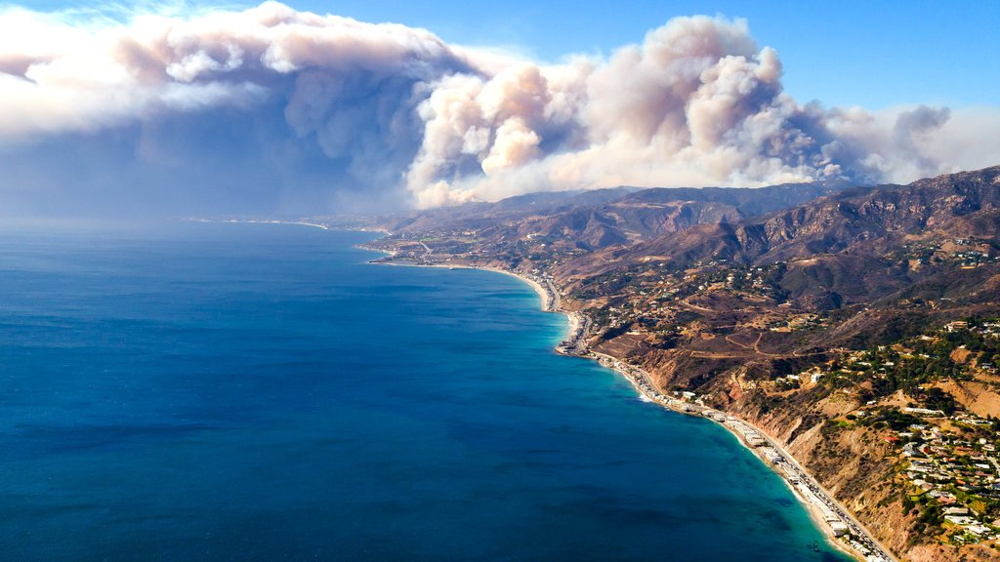

### Climate Change in the news:
As climate change effects worsen, it's discussed more every day in the
news. It's necessary and beneficial to have climate change be a big part
of the current news so people aren't left in the dark with what's going
on with their own planet. The more people that are educated on this, the
better chance we have of more people doing their part. Weather events
that are out of the ordinary are often the topic of discussion, and
usually disrupt the surrounding life. Animals, plants, nearby
communities, and life in general is affected by these concerning weather
patterns. There have been many events over the years that have caught
the attention of many, and the only blame can be climate change. Topics
such as fires, flooding, sea levels rising, temperature patterns, etc.
are usually taking up events being discussed on the news. Some recent
events that have been brought to attention include:

-   A California fire in 2018 that left a mark on around 100,000 acres
    of land, led to high levels of bacteria in the surrounding coastal
    waters. This was the case due to the runoff of bacteria falling into
    the water nearby. This cluster of bacteria in the water created
    cloudiness for months after the fire.
-   As of February 2022, it was recorded that the maximum sea ice
    levels are the 10th lowest non satellite records.
-   Coastal flooding is becoming an issue that we're seeing patterns of
    more frequently. By 2050, it's expected that sea levels will have
    risen by a foot. This means flooding is going to be more common
    within the next 30 years. Thai is extremely concerning for coastal
    areas like Florida and California.
-   2021 was recorded as the 6th warmest year in history. 2021 is one
    of a few years that is showing a trend in an extreme increase of
    temperature. 2018 tied with 2021 with both of them being the 6th
    warmest years ever.
-   If we all do our part to reduce the production of emissions and
    lessen the intensity of climate change, we could be dramatically
    improving the health of many by 2030. If we all were to heavily
    focus on reducing our own usage of these gases, we would be making a
    tremendous impact that would later on make all the difference.

#### sources
[https://climate.nasa.gov/news/3140/2021-tied-for-6th-warmest-year-in-continued-trend-nasa-analysis-shows](https://climate.nasa.gov/news/3140/2021-tied-for-6th-warmest-year-in-continued-trend-nasa-analysis-shows/)

[https://climate.nasa.gov/news/3155/arctic-sea-ice-maximum-at-tenth-lowest-in-satellite-record](https://climate.nasa.gov/news/3155/arctic-sea-ice-maximum-at-tenth-lowest-in-satellite-record/)

[https://climate.nasa.gov/news/3149/california-fire-led-to-spike-in-bacteria-cloudiness-in-coastal-waters](https://climate.nasa.gov/news/3149/california-fire-led-to-spike-in-bacteria-cloudiness-in-coastal-waters/)

[https://climate.nasa.gov/news/3134/reducing-emissions-to-lessen-climate-change-would-yield-dramatic-health-benefits-by-2030](https://climate.nasa.gov/news/3134/reducing-emissions-to-lessen-climate-change-would-yield-dramatic-health-benefits-by-2030/)

[https://www.noaa.gov/news-release/us-coastline-to-see-up-to-foot-of-sea-level-rise-by-2050](https://www.noaa.gov/news-release/us-coastline-to-see-up-to-foot-of-sea-level-rise-by-2050)

